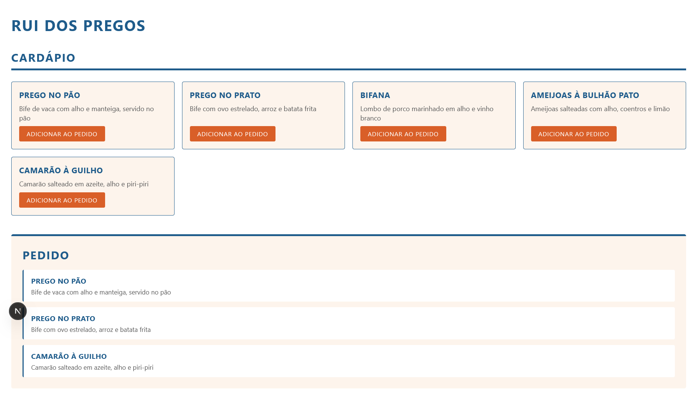

# Rui dos Pregos, aplicação em Micro Frontends

Projeto desenvolvido durante o curso de Front-End da EBAC, na tarefa sobre Micro Frontends.

A ideia foi dividir uma aplicação de pedidos de restaurante em três aplicações independentes e integrá-las com Webpack Module Federation. O cardápio e o pedido rodam em servidores separados, e o container carrega os dois em tempo de execução, sem ter o código deles dentro de si.



## Estrutura

| Aplicação | Papel | Porta |
| --------- | ----- | ----- |
| `container` | Aplicação principal, importa os dois micros | 3000 |
| `cardapio` | Lista de pratos com botão de adicionar | 3001 |
| `pedido` | Mostra os itens escolhidos | 3002 |

Monorepo com um único repositório Git na raiz. Cada pasta é um projeto Next completo, com o próprio `package.json`, o próprio `node_modules` e o próprio `next.config.mjs`.

## Tecnologias

- React 19
- Next.js 15 com Pages Router
- Webpack Module Federation, pelo plugin `@module-federation/nextjs-mf`
- JavaScript, sem TypeScript
- CSS Modules

O enunciado recomenda Next entre as versões 12 e 15 com Pages Router, porque o Module Federation não é compatível com o App Router nem com a versão 16.

## Funcionalidades

O cardápio exibe cinco pratos, cada um com nome, descrição e um botão de adicionar ao pedido. Os dados são estáticos, num arquivo separado.

O pedido começa vazio, com uma mensagem, e vai listando os pratos conforme os botões são clicados. O mesmo prato pode entrar mais de uma vez.

O container junta os dois na mesma tela e não tem lógica de negócio nenhuma. Ele só sabe onde encontrar cada micro.

## Como rodar

Precisa de Node.js 18.18 ou superior.

### Instalar as dependências

Uma vez em cada pasta:

```bash
cd cardapio && npm install
cd ../pedido && npm install
cd ../container && npm install
```

### Subir as três aplicações

Cada aplicação ocupa um terminal, porque o `npm run dev` fica rodando enquanto o servidor está de pé.

Terminal 1:

```bash
cd cardapio
npm run dev
```

Terminal 2:

```bash
cd pedido
npm run dev
```

Terminal 3:

```bash
cd container
npm run dev
```

A ordem importa. O cardápio e o pedido precisam estar de pé antes do container, porque ele busca o `remoteEntry.js` dos dois quando a página carrega. Se você abrir na ordem errada, basta recarregar a página do container depois.

Com os três rodando, a aplicação integrada fica em `http://localhost:3000`.

### Testar cada micro sozinho

Cada micro tem uma página `index` que serve para rodá-lo isolado, sem depender do container:

- `http://localhost:3001` mostra o cardápio
- `http://localhost:3002` mostra o pedido, que responde a eventos disparados no console

### Uma observação sobre o desenvolvimento

Os scripts `dev` e `build` definem a variável `NEXT_PRIVATE_LOCAL_WEBPACK=true` com o `cross-env`. O plugin do Module Federation precisa dela para usar o webpack instalado no projeto em vez da cópia interna do Next. O `cross-env` está aí para o comando funcionar igual no Windows, no macOS e no Linux.

Outro ponto: o hot reload funciona dentro de cada aplicação, mas não atravessa a fronteira entre elas. Se você editar um micro com o container aberto, o container continua servindo o chunk que baixou antes. Nesse caso, pare os servidores, apague a pasta `.next` do micro alterado e a do container, e suba tudo de novo.

## Como funciona a comunicação

Os dois micros não se conhecem. Nenhum importa o outro, e nenhum recebe props do container. A comunicação acontece por um evento global do navegador, o que é a forma sugerida pelo enunciado.

O fluxo é este:

1. O usuário clica em "Adicionar ao pedido" num card do cardápio
2. O `Cardapio.jsx` dispara `window.dispatchEvent(new CustomEvent("adicionarAoPedido", { detail: prato }))`
3. O `Pedido.jsx`, que registrou um `addEventListener` para esse mesmo nome, recebe o evento
4. Ele lê o prato em `evento.detail` e adiciona à própria lista de estado

O acordo entre os dois é só o nome do evento e o formato do conteúdo:

| Item | Valor |
| ---- | ----- |
| Nome do evento | `adicionarAoPedido` |
| Conteúdo em `detail` | o prato inteiro, `{ id, nome, descricao }` |

Como esse acordo não está garantido por nenhum import, ele fica documentado em comentário nos dois componentes. Renomear o evento de um lado sem renomear do outro quebra a comunicação sem gerar erro no console, o botão simplesmente para de fazer efeito.

O `useEffect` que registra o listener devolve o `removeEventListener` na limpeza. Sem isso, o `reactStrictMode` monta o efeito duas vezes em desenvolvimento e cada clique adicionaria o item duplicado.

Vale registrar que essa não é a única forma de resolver o problema. Uma alternativa seria o container manter o estado do pedido e passar tudo por props, mas aí os micros deixariam de ser independentes e o container acumularia lógica de negócio. O evento global mantém cada um responsável pelo próprio estado.

## Como funciona a integração

Cada micro expõe apenas o seu componente principal, não a página inteira:

| Micro | Nome | Exposto | Arquivo publicado |
| ----- | ---- | ------- | ----------------- |
| `cardapio` | `cardapio` | `./Cardapio` | `localhost:3001/_next/static/chunks/remoteEntry.js` |
| `pedido` | `pedido` | `./Pedido` | `localhost:3002/_next/static/chunks/remoteEntry.js` |

O container declara os dois como `remotes` no `next.config.mjs` e os importa com `React.lazy` e `Suspense`, dentro de um wrapper por micro em `container/src/components`. A página importa esse wrapper com `next/dynamic` e `ssr: false`, porque o módulo remoto vem de outro servidor e não existe durante a renderização no servidor.

O estilo de cada micro fica em CSS Modules dentro do próprio componente, e não no `globals.css`. O motivo é que o `globals.css` do micro não é carregado quando o componente roda dentro do container, mas o CSS Module viaja junto com o componente pela federação. É o que mantém cada micro apresentável também no teste isolado.

## Organização das pastas

Mesma estrutura nas três aplicações:

```
src/
├── components/    componentes de interface, com o CSS Module ao lado
├── data/          dados estáticos, só no cardápio
├── pages/         páginas do Next
└── styles/        globals.css
```

## Limitações conhecidas

O projeto está no Next 15.5.7 e o `npm audit` aponta 14 avisos. Subir de versão não é possível aqui: o `npm audit fix` leva o Next para a versão 16, que não é compatível com Module Federation, e desfaz o `enhanced-resolve` fixado no `overrides`, necessário para o plugin funcionar. Os avisos são de recursos que este projeto não usa, como App Router, Server Actions e otimização de imagem.

O `ANOTACOES.md` na raiz registra o caminho até chegar nesse conjunto de versões, com os erros que apareceram e o motivo de cada escolha.
